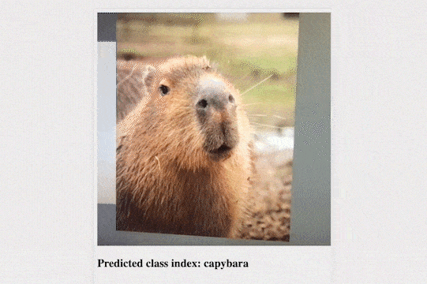

# Week 3 In-Class Activity  

## 1. Image Classifier

Choose either Option 1 or 2:

#### Option 1: Create your own image dataset from Pinterest and train a image classifier with it

 - Download images from Pinterest:
   - In the [week-3](https://git.arts.ac.uk/jgillick/Critical-Coding-3-2025/tree/main/week-3) folder, load the `01_download_images.ipynb` notebook (Don't forget to select your `coding-3` environment in VSCode first).  
   - Follow the instructions in the notebook, make sure to **reapeat the step 2 and step 3** in the notebook at least twice to create an image dataset with at least 2 categories of images.
 - Train the image classifier:
   - Load the `02a_image_classifier_pytorch.ipynb` notebook.
   - Follow instructions in the notebook (**make sure to follow its option 1**), train, save, and test an image classifier using the dataset you created.  
   - Read the text carefully throughout the notebook, and make sure you can run everything in it. Ask for help ASAP if anything is not clear or if you get an error.
   - There are a few questions in **step 1.3**, **step 3.4**, and **step 4.3**, write your answers to these questions in your notebook and save the notebook.
  

#### Option 2: Train a sketch recognition model using a small subset of Google's Quick, Draw! dataset.  

 - Train the sketch recognition classifier:
   - In the [week-3](https://git.arts.ac.uk/jgillick/Critical-Coding-3-2025/tree/main/week-3) folder, start from the `02a_image_classifier_pytorch.ipynb` notebook (Don't forget to select your `coding-3` environment in VSCode first).  
   - **Make sure to go for the Option 2 in Step 0**, it will help you to unzip the sketch dataset.
   - Follow instructions in the notebook, train, save, and test an image classifier using the sketch dataset.
   - Read the text carefully throughout the notebook, and make sure you can run everything in it. Ask for help ASAP if anything is not clear or if you get an error.
   - There are a few questions in **step 1.3**, **step 3.4**, and **step 4.3**, write your answers to these questions in your notebook and save the notebook.

## 2. Text Classifier  

 - In the [week-3](https://git.arts.ac.uk/jgillick/Critical-Coding-3-2025/tree/main/week-3) folder, load the `02b_text_classifier_pytorch.ipynb` notebook.
 - Follow instructions in the notebook, train, save, and test a text classifier.  
 - Read the text carefully throughout the notebook, and make sure you can run everything in it. Ask for help ASAP if anything is not clear or if you get an error.
 
 
## 3. [Optional] Real-time Image Classifier  

 </img>
 
 - In the [week-3](https://git.arts.ac.uk/jgillick/Critical-Coding-3-2025/tree/main/week-3) folder, load the `03_[optional]_image_classifier_in_realtime.ipynb` notebook.
 - Follow instructions in the notebook, it will allow you to run the image classifier you trained in real-time, taking inputs from your webcam, or a Javascript drawing canvas.  
 
